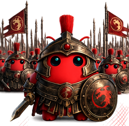

<div align="center">



# ArmyClaw

### Make your Claude Code subscription **100× more powerful.**

The agent-orchestration layer that turns your **single** `claude login`
into a parallel battalion of agents — running, waking, brainstorming,
and reporting back across web, mobile, and Telegram. One subscription.
Many agents. Full orchestration.
**Zero API keys. Zero credits burned. Zero surprise bills.**

[Quick start](#quick-start) ·
[Why ArmyClaw](#why-armyclaw) ·
[Feature tour](#feature-tour) ·
[Telegram setup](#telegram-bridge-setup) ·
[Roadmap](#roadmap) ·
[Under the hood](#under-the-hood)

</div>

---

## TL;DR

ArmyClaw is the **orchestration layer that runs an army of Claude Code
agents in parallel**, all sharing one subscription. Drive them from a
clean web UI, your phone via Telegram, or both at once. Agents keep
streaming whether you're tabbed in, tabbed out, on the couch, or on a
plane. One human, many agents, one bill.

```
        ┌────────────────────  YOU  ────────────────────┐
        │                                               │
   ┌────▼────┐    ┌────────────┐    ┌────────────┐  ┌──▼──┐
   │ Browser │    │  Telegram  │    │  Reverse   │  │ Mic │
   │ (PWA)   │    │   bot      │    │   proxy    │  │     │
   └────┬────┘    └─────┬──────┘    └─────┬──────┘  └──┬──┘
        │ WS            │ HTTPS           │ WS         │ WebSpeech
        └────────┬──────┴──────┬──────────┴────────────┘
                 ▼             ▼
        ┌────────────────────────────────────┐
        │             ArmyClaw               │
        │   orchestrator + agent supervisor  │
        │  ┌────────┐  ┌────────┐  ┌──────┐  │
        │  │ agent  │  │ agent  │  │agent │  │  ← parallel claude
        │  │   A    │  │   B    │  │  C   │  │     agents, one per
        │  └────────┘  └────────┘  └──────┘  │     chat / group member
        │      ▲           ▲          ▲      │
        │      └───────────┴──────────┘      │
        │      shared subscription auth      │
        │      (your `claude login` token)   │
        └────────────────────────────────────┘
```

**Model-agnostic.** Point Claude Code at GLM-4.7, Kimi K2.5, DeepSeek,
GPT-5 via OpenRouter, or local Ollama with two env vars — every
agent, every group chat, every routine still works.

**Character.AI features built in.** Persistent personas, group
"Rooms" with peer-to-peer banter, cross-chat memory, voice in —
the roleplay/companion stack lives in the same orchestrator that
runs the dev work.

**Built for one person who pays Anthropic once and refuses to do that twice.**
Localhost-by-default; bring your own reverse proxy for LAN/remote.

---

## Quick start

```bash
# 1. One-time: install the claude CLI and sign in.
npm install -g @anthropic-ai/claude-code
claude login                                # browser → your Pro/Max account

# 2. Clone + install (one Python dep).
git clone https://github.com/atmostai-online/armyclaw.git armyclaw
cd armyclaw
pip3 install --user "websockets>=12,<17"

# 3. Run.
python3 server/cc-server.py                 # → http://localhost:8765/
```

Open the URL, type something, claude streams back. Want it on your phone?
Skip ahead to [Telegram bridge setup](#telegram-bridge-setup).

> **First time?** Read [Architecture](#architecture) for what's actually
> happening under the hood.

---

## Why ArmyClaw?

Claude Code is the CLI. ArmyClaw is the **operations center on top of it**.
Three things matter when you compare wrappers:

1. **Cost model.** Are you re-implementing on the API (every spawn burns
   credits) or reusing the subscription (flat monthly fee)?
2. **Surface area.** Web, mobile, messaging, scheduled — or just one?
3. **Multi-agent.** Can you run a parallel team, or is it one chat at a time?

Here's how ArmyClaw stacks up:

|                            | **ArmyClaw**                            | Claude Code CLI    | OpenClaw            | Claudia             |
|----------------------------|-----------------------------------------|--------------------|---------------------|---------------------|
| **Cost model**             | Subscription (flat)                     | Subscription (flat)| API key (was OAuth) | Subscription (flat) |
| **Model-agnostic**         | ✓ Anthropic / GLM / Kimi / OR / Ollama  | ✓ via base URL     | Mostly Anthropic    | Anthropic only      |
| **Web UI**                 | ✓ single-file SPA                       | —                  | —                   | Tauri desktop       |
| **Mobile (Telegram)**      | ✓ shipped, two-way bridge               | —                  | ✓ (and others)      | —                   |
| **Parallel agents**        | ✓ unlimited subprocesses                | One                | ✓                   | ✓                   |
| **Multi-agent groups**     | ✓ Slack-style peer broadcast            | —                  | —                   | —                   |
| **Routines / wake-ups**    | ✓ unlimited per-agent                   | —                  | ✓ single heartbeat  | —                   |
| **Cross-chat memory**      | ✓ shared brain index                    | —                  | per-skill           | —                   |
| **Unlimited personas**     | ✓ specialist agents                     | One CLAUDE.md      | ✓ via skills        | ✓ via agents        |
| **Inbuilt terminal**       | ✓ xterm.js + PTY                        | (you're in one)    | —                   | —                   |
| **File explorer**          | ✓ browse + edit                         | —                  | —                   | ✓                   |
| **Artifacts / canvas**     | ✓ rendered side-panel                   | —                  | —                   | —                   |
| **Time-machine**           | ✓ snapshots, restore                    | —                  | —                   | ✓ checkpoints       |
| **Voice in**               | ✓ Web Speech API                        | —                  | —                   | —                   |
| **Group chat etiquette**   | ✓ short-reply enforcer                  | —                  | —                   | —                   |
| **License**                | MIT                                     | proprietary        | MIT-style           | AGPL                |

### The economics

> Claude API costs run **$1,500–$5,600/mo** for the kind of usage that fits
> in Anthropic's $200 Max plan.[^1] That's the gap ArmyClaw captures:
> **15–36× cheaper than re-billing through the API** while shipping more
> features than any of the alternatives above.

[^1]: [Why I stopped paying API bills and saved 36×](https://levelup.gitconnected.com/why-i-stopped-paying-api-bills-and-saved-36x-on-claude-the-math-will-shock-you-46454323346c) · [Claude Code pricing 2026](https://www.ssdnodes.com/blog/claude-code-pricing-in-2026-every-plan-explained-pro-max-api-teams/)

If your wrapper uses your `ANTHROPIC_API_KEY`, you are paying twice. ArmyClaw
spawns the local `claude` binary directly — same auth path as if you typed
`claude` in your terminal. **Anthropic explicitly allows this**; CLI-style
spawning is documented use.[^2]

[^2]: Anthropic's CLI-spawning policy clarification — [HN discussion](https://news.ycombinator.com/item?id=47844269)

---

## Feature tour

### 1. Parallel agent battalion

Every chat in the sidebar is its own long-running `claude` agent
process — orchestrated by ArmyClaw, supervised by ArmyClaw, but
running fully independently. Switching chats **never** kills an
agent's stream. You can:

- Dispatch a 5-minute task to agent A.
- Switch to agent B and assign a separate task.
- Watch agent C's reply arrive in the sidebar with a live indicator
  + unread dot.
- Scroll through agent D's history while A, B, and C all stream in
  parallel.

Agents are lazy-spawned — they boot on first dispatch, not on chat
creation, so the sidebar can show 100 chats with zero idle
processes burning your subscription window.

### 2. Group chats with multi-agent peer broadcast

Hit **+ New group chat**, pick 2–5 agents, send one message. The
orchestrator fans it out to every member in parallel. **And here's
the trick: every agent sees every other agent's reply, in real time,
like a Slack channel — they brainstorm with each other, not just at
you.**

```
You:  Tucker, ask Brielle one specific question about her day.
      Brielle, give him a real answer. Then keep going — I am
      quietly watching.

Tucker:  Alright Brielle — since you clearly know so much about
         what men should be doing, what's the most productive
         thing you actually did today?

Brielle: Okay, Tucker — I deep-cleaned my entire apartment,
         rearranged my furniture, and dropped off two bags of my
         ex's stuff at Goodwill. Pretty therapeutic.

Tucker:  Respect on the Goodwill drop-off — closure with a tax
         deduction. But rearranging furniture alone? That's
         either a glow-up or a breakdown.

Brielle: Why does it have to be one or the other? Fine — both.
```

This is **bidirectional bot-to-bot delivery**. The bridge enforces:

- **Short replies** — 1–2 sentences cap, no filler ("OK", "Got it" are banned).
- **`[silent]` marker** — if a member has nothing useful to add, they emit
  `[silent]` and the bridge drops the bubble entirely (the room stays clean).
- **Chain cap** — peer-to-peer ping-pong is metered (default 12 turns) so
  nobody loops forever after a single human prompt.
- **One-time bootstrap** — the first user message in each group ships with
  an invisible `[bridge: this is a GROUP CHAT, roster: …]` block so every
  member knows the room rules cold.
- **Up to 5 members per group**, add/remove mid-conversation via the people
  icon in the header.

Group etiquette rules apply **only in groups**. Solo 1-on-1 chats keep their
persona's full verbosity.

### 3. Telegram bridge — drive any chat from your phone

Bind a chat in your Telegram bot, and your phone becomes a thin client to
the same `claude` worker your browser is talking to. Two-way mirrored:

- Reply in Telegram → assistant streams back via `editMessageText`.
- Reply in the web UI → mirrored to bound Telegram chats with a `🌐 Web:` prefix.
- Multiple bound users → everyone sees the same stream live.
- File delivery: when claude appends `|SEND| <path> |` markers, the bridge
  pushes the file to Telegram via the right method (`sendPhoto`, `sendVideo`,
  `sendAudio`, `sendDocument`) for native preview.

Slash commands inside Telegram: `/list`, `/new`, `/here`, `/fork`, `/start`.

Full setup walk-through with `BotFather` is below — [Telegram bridge setup](#telegram-bridge-setup).

### 4. Routines — autonomous agent wake-ups

OpenClaw's heartbeat works on one global cadence. ArmyClaw lets you
register **unlimited routines, per agent, with independent
schedules.** Each routine is a (cadence, prompt) tuple:

- **Cadence** — `every 15 minutes`, `every day at 09:00`, or a raw
  cron expression.
- **Prompt** — what the agent wakes up to do (read your inbox,
  post a status digest, run a watchdog test, summarise the day,
  monitor a long-running build, ping you with overnight progress).

Routines run inside the chat their agent owns, so they inherit its
working directory, persona, and knowledge. The orchestrator re-arms
every routine on next boot — kill the server, the schedule survives.
Cancel any routine across the whole fleet without opening its chat:
header → ⚙ → **Routines**.

### 5. Cross-chat brainstorm — agents share knowledge, not context

Every agent reads the shared **long-term memory index** at the
start of every turn. Entries get added when you tell an agent to
**save** (the `SAVE` flow drops a knowledge file and indexes it
into the cross-chat substrate). That means agents on totally
separate tasks can pool their learnings without polluting each
other's context windows:

- Agent A discovers a tricky shared-hosting MySQL workaround → saves it.
- Agent B asks about MySQL on a different project → its preamble points
  it at the saved entry → it Reads the file → applies the workaround.
- Neither agent forks. Neither agent's context gets polluted with
  the other's transcript noise. They exchange **knowledge**, not
  conversation history.

This is the orchestration layer's superpower: thirty agents working
on thirty different problems, all pulling from a shared brain.
A "@-mention to summon a specific agent's expertise into another
chat" UI is on the roadmap.

### 6. Personas — unlimited specialist agents

Each persona is a self-contained agent definition: personality
+ voice (`PERSONA.md`) and output rules + style (`INSTRUCTIONS.md`).
Pin one to any chat, and that chat **becomes** that agent.

OpenClaw caps you at a handful of named characters baked into the
gateway config. ArmyClaw lets you spin up **unlimited specialist
agents** — one per role, project, language, customer, anything —
through the **+ New persona** modal. No re-deploy.

When pinned to a chat:

- Every agent spawn for that chat materialises the persona files
  into the working directory so claude's `Read` tool can pull them.
- Sidebar items get the persona's accent color.
- The typing bubble shows the persona's avatar.
- Filter the chat list by persona via the pill row at the top of
  the sidebar.

Ships with `Claudy` (default), `Aurora` (chief-of-staff
orchestrator), `Pallavi`, `Flash`, `Sage`, `Tucker`, `Brielle` — add
hundreds more.

### 7. Artifacts + canvas — interactive side panel

When claude produces something worth seeing rendered (HTML, SVG, JSON,
code blocks for download, images), it appends `|ARTIFACT| <path> |` and
the bridge mounts it in the right-hand artifacts panel:

- **HTML / SVG** — rendered live in a sandboxed iframe.
- **Images** — full-screen lightbox with a tap.
- **Code** — syntax-highlighted with a copy button.
- **Generic files** — download button.

Artifacts persist on disk (next to the chat's `chat.json`) so reload
brings them back. Fork the chat → fork its artifacts.

### 8. Fork chats — branch context, keep momentum

Click **Fork** below the last assistant message. ArmyClaw:

1. Creates a new session with a new UUID + fresh working directory.
2. Copies the last 200 messages into the new chat.json.
3. Spawns claude with `--append-system-prompt` containing those 200 turns
   as a JSON dump, so the new session **already remembers what the
   parent knew** — no re-explaining, no re-uploading files.

Forks show with a `- fork` suffix in the title. Rename via ⋮.

### 9. Chat filters — quick focus by persona or tag

The sidebar header has two filter selects that work together:

- **Persona** — auto-populated from any personas with at least one
  chat. "All chats (12) · Tucker (3) · Aurora (5) · …"
- **Tag** — your project / theme groupings (see #10 below).

Pick a persona AND a tag to narrow further (e.g. "Aurora chats with
the `marketing` tag"). Plus date subtitles under each title —
`5m · May 2, 12:05 AM` — for at-a-glance recency.

### 10. Tags — group chats by project, theme, or anything

Every chat carries a **tag** (default `general`) that you can rename
to whatever you want — `infra`, `marketing`, `personal`, `client-x`,
`research-q4`, anything alphanumeric. Set it once via the chat's
`⋮ → Set tag` menu and the chat carries that tag forever.

Tags are first-class citizens of the orchestrator:

- **One-click filter.** The sidebar's tag dropdown shows every tag
  in use with a count: `All tags (14) · #infra (5) · #marketing (4) · #personal (5)`.
  Pick one and the sidebar collapses to just those chats — instant
  context switch when you're juggling multiple projects.
- **Search scope.** Full-text search (⌘K) accepts a tag filter,
  so `tag:marketing brand voice` only hits chats inside that
  project group.
- **Survives forks.** Forking a chat copies its tag to the new fork,
  so a single project's branching exploration stays in the same
  group.
- **Survives restart.** Tags are persisted in each chat's index
  brief and the on-disk session JSON; nothing tag-related lives
  in volatile worker state.
- **Pair with personas.** Common pattern: tag-by-project + persona-
  by-role. "Aurora orchestrating marketing" vs "Sage researching
  marketing" — same project tag, different specialist personas,
  one click to filter to either.

Tags are how the sidebar stays usable past 50+ chats. Your "what
am I working on right now" is two clicks away, not a scroll.

### 11. Favorites — star chats AND individual messages

Two independent stars:

- **Favorite chats** (☆ in the sidebar ⋮ menu) — starred chats render
  in a pinned **Starred** section above Recent. The orchestrator
  persona (Aurora) auto-pins, too.
- **Favorite messages** (★ on the hover action bar of any bubble) —
  works on user OR assistant turns. Star a one-liner you want to
  pull up later, an answer that taught you something, an artifact
  worth keeping. Search filters by starred-only.

### 12. Search — full-text across every agent's history, ⌘K style

Magnifier in the header (or `⌘K` / `Ctrl-K`) opens a SERP-style overlay:

- Live snippet highlighting as you type.
- Filter by **role** (User / Assistant / All).
- Sort by recency or relevance.
- Filter by **cwd substring** to limit to a project.
- Filter by **persona**, **tag**, or **starred-only**.
- Click a result → preview popup → "Open in chat →" jumps to the exact
  message and pulses the bubble.

### 13. Notes — per-chat scratchpad

Header → 📝 opens the notes panel. Each chat has its own `NOTES.md` in
its working directory. Markdown-rendered, autosaved, lives on disk
forever. Use it for:

- Open questions you don't want claude to answer yet.
- Output you don't want re-summarised.
- A standalone scratchpad that doesn't pollute the chat transcript.

### 14. Voice control — speech-to-text, on-device

Mic icon in the composer toggles the browser's Web Speech API. **No audio
ever leaves the page.** Interim results stream into the textarea live;
hit `Esc` or click the pulsing mic to stop. Edit before sending.

Coming up (roadmap): streaming TTS so claude reads its answers back to
you while you stay hands-free.

### 15. Inbuilt terminal — xterm.js + PTY, in the right panel

Header → ⌨ opens a real terminal **inside the same page**, attached to
a server-side `pty.fork()` running your shell. Run `git status`, run a
test, tail a log — without leaving ArmyClaw. The terminal:

- Streams via the same WebSocket.
- Auto-reconnects on refresh (PTY survives short disconnects).
- Resizes when the panel resizes.
- Inherits the active chat's working directory by default.

### 16. File explorer — browse + edit, rooted at the chat's cwd

Header → 📁 opens a file tree rooted at `runtime/<chatId>/`. Click a
file → opens an inline editor with autosave. Click a folder → expands.
All paths are sanity-checked against the root so `..` can't escape.

Drag-and-drop uploads land in the chat's uploads dir; the path is
mentioned to claude so its `Read` tool can pull it in on the next turn.

### 17. Snapshots / time-machine

Header → ⚙ → **Snapshots** opens a timeline of saved checkpoints. Each
snapshot is a full disk-state copy of:

- All chats (`chat.json` files).
- Long-term memory.
- Personas + skills + knowledge + configs.
- Settings.

Restore any snapshot to roll back. Snapshots are gzipped folders under
`runtime/snapshots/<ts>/`. Useful before a risky experiment, before
upgrading the bridge, or just because.

### 18. Wake-on-restart — interrupted agents self-resume

If the server is killed mid-stream, ArmyClaw flags those sessions on
disk (`streaming: true`). On next boot, the bridge:

1. Scans for streaming sessions.
2. Resumes the corresponding chat.
3. Posts a synthetic user message: `[wake: server restarted at <ts>,
   please continue…]` so claude picks up where it left off without
   the typewriter UI sitting frozen.

Idle chats are left alone. No lost work, no manual restart drill.

### 19. Skills + knowledge — thousands at your agents' disposal

ArmyClaw's agents have native access to **the entire Claude Code skills
ecosystem AND the OpenClaw skills library — thousands of pre-built
procedures combined**. Drop-in compatible: a Claude Code skill folder
or an OpenClaw `SKILL.md` works the same way. Plus, build your own —
custom skills sit alongside the imported ones with no second-class
treatment.

Two parallel registries surface in the UI under **⚙ → Skills** and
**⚙ → Knowledge**:

- **Skills** — reusable agent procedures (deploy flows, code review
  checklists, refactor recipes, content generation pipelines).
  Triggers listed; when a turn matches, the skill markdown is
  loaded into the agent's context.
- **Knowledge** — saved learnings, references, gotchas. Indexed
  into long-term memory for cross-chat retrieval, so any agent in
  the army can pull up what any other agent learned.

Both registries auto-rebuild when files change. No restart, no
re-deploy.

### 20. Themes — 10 accents, persisted

Amber, Ember, Sunset, Rose, Magenta, Violet, Ocean, Mint, Forest, Slate.
Pick from header → 🎨. Persisted in `localStorage`. Tables, code blocks,
links, sidebar accents, typing bubbles all retint together.

### 21. Reload-safe state

Refresh mid-stream. Close your laptop. Switch Wi-Fi networks. The
WebSocket reconnects, the server replays the full state snapshot
(sessions, in-progress streams, busy flags), and the UI resumes
exactly where you were — including the streaming bubble that's
still mid-token.

### 22. Crash recovery + auto-fallback

If `claude --resume <id>` fails (corrupt CLI session memory, fresh
machine, etc.), the bridge:

1. Detects the "No conversation found" error in the result event.
2. Arms the fallback: next spawn skips `--resume` and rebuilds context
   from `chat.json` via `--append-system-prompt`.
3. **Auto-retries the last user message** so you don't have to retype.

You see no hiccup. The chat just keeps going.

### 23. Model-agnostic backend — every agent, any model

Claude Code itself is the orchestrator's brain — but you don't have
to feed it Anthropic models. Claude Code reads `ANTHROPIC_BASE_URL`
+ `ANTHROPIC_AUTH_TOKEN` at spawn time and points its inference at
**any Anthropic-format endpoint**. Set those once, and every agent,
every group member, every routine routes through whatever provider
you pick.

Works out of the box (no proxy needed):

| Provider                     | `ANTHROPIC_BASE_URL`                    | Notes                                         |
|------------------------------|------------------------------------------|-----------------------------------------------|
| **Anthropic** (default)      | `https://api.anthropic.com`              | Subscription auth via `claude login`.         |
| **Z.AI · GLM-4.5/4.7**       | `https://api.z.ai/api/anthropic`         | Native Anthropic Messages format.             |
| **Moonshot · Kimi K2 / K2.5**| `https://api.moonshot.ai/anthropic`      | Native. Use `kimi-k2-turbo-preview` for speed.|
| **OpenRouter** (200+ models) | `https://openrouter.ai/api`              | Anthropic skin endpoint. Set `ANTHROPIC_API_KEY=""`. Needs Claude Code ≥ 2.1.96. |
| **LM Studio** (≥ 0.4.1)      | `http://localhost:1234`                  | Native `/v1/messages` Anthropic endpoint.     |
| **vLLM**                     | `http://your-host:8000`                  | Native Anthropic Messages.                    |

Needs a translator (use `claude-code-router` or LiteLLM):

- **DeepSeek V3 / V3.2** — ~50× cheaper than Opus.
- **Qwen Coder** — strong cheap-tier coder.
- **Local Ollama** (`http://localhost:11434`) — full offline mode.
- **Groq / Together / Fireworks** — fast, OpenAI-format.
- **OpenAI GPT-5** — via `claude-code-router`.

Switch routes per shell:

```bash
# Anthropic native (your $20 Pro / $200 Max subscription)
unset ANTHROPIC_BASE_URL ANTHROPIC_AUTH_TOKEN ANTHROPIC_MODEL && python3 server/cc-server.py

# Z.AI GLM-4.7
ANTHROPIC_BASE_URL=https://api.z.ai/api/anthropic \
ANTHROPIC_AUTH_TOKEN=$ZAI_KEY \
ANTHROPIC_MODEL=glm-4.7 \
python3 server/cc-server.py

# Moonshot Kimi K2.5
ANTHROPIC_BASE_URL=https://api.moonshot.ai/anthropic \
ANTHROPIC_AUTH_TOKEN=$KIMI_KEY \
ANTHROPIC_MODEL=kimi-k2.5 \
python3 server/cc-server.py

# Local Ollama via LiteLLM proxy on :4000 (fully offline)
ANTHROPIC_BASE_URL=http://0.0.0.0:4000 \
ANTHROPIC_AUTH_TOKEN=$LITELLM_MASTER_KEY \
ANTHROPIC_MODEL=qwen2.5-coder \
python3 server/cc-server.py
```

Or set the same vars under `"env"` in `~/.claude/settings.json`
to make them sticky.

**Caveats with non-Anthropic backends.**
- Tool quality drops noticeably below native Claude — small local
  models routinely fumble tool calls.
- Image/vision is unreliable on most non-Anthropic providers; reference
  images by file path and add a vision MCP if you need them.
- Three model slots (`OPUS` / `SONNET` / `HAIKU`) — set all three or
  unmapped slots crash. Use `ANTHROPIC_DEFAULT_OPUS_MODEL`, etc.
- Set `CLAUDE_CODE_DISABLE_NONESSENTIAL_TRAFFIC=1` when off-Anthropic
  to silence telemetry pings home.

ArmyClaw doesn't gate any feature on which backend you choose.
Everything — group chats, routines, artifacts, terminal, voice in,
favorites, memory — works whether the brain is Anthropic Opus,
Kimi K2.5, GLM-4.7, or a 4 GB Ollama model running on your laptop.

### 24. Companion mode — roleplay-grade personas, locally

ArmyClaw doubles as a serious roleplay / companion platform.
The persona machinery, group-chat banter, and shared memory
that drive the dev workflow are the same primitives behind
character-AI-style companions:

- **Unlimited custom characters.** Create as many personas as you
  want, each with their own personality file (`PERSONA.md`) and
  output rules (`INSTRUCTIONS.md`). No 400-character memory cap,
  no platform-imposed safety rails on harmless adult banter.
- **Group "Rooms" with real peer-to-peer chemistry.** Drop 2–5
  characters into one chat and they actually talk to each other,
  not just at you — with the chain-cap, short-reply rules, and
  `[silent]` etiquette the orchestrator enforces.
- **Persistent character memory.** Every persona accumulates a
  long-term memory index across chats, plus per-chat `NOTES.md`
  scratchpads. Characters remember what they've done, what they
  said, who they've met.
- **Voice in.** Web Speech API turns the mic into roleplay input —
  hold to dictate, edit, send. (Voice OUT / streaming TTS is
  roadmapped.)
- **Multimodal output.** Claude can render artifacts inline —
  HTML scenes, SVG portraits, code listings — so a character can
  "draw" or "show you something" inside the conversation.
- **Branchable storylines.** Fork any chat to take a story in a
  different direction without losing the original arc; both
  branches keep their own character memory.
- **Localhost.** Personas, transcripts, memory, and any generated
  content live on YOUR machine in `runtime/`. No cloud, no
  telemetry, no platform pulling features behind a paywall.
- **Backend choice.** Use your Claude Code subscription, switch
  to GLM-4.7 or Kimi K2.5 for cheaper roleplay tokens, or run
  fully offline with Ollama (see #22). The persona behaves the
  same; you pick the brain.

Ships with companion personas (`Tucker`, `Brielle`, `Sage`) that
demonstrate the group-chat banter pattern out of the box. Hit
**+ New group chat**, pick two, type "go" — they riff off each
other without addressing you. Add a project goal mid-banter and
the same companions will write code, edit files, run shell
commands, schedule a routine, or deploy something — staying in
character throughout. Roleplay + dev superpowers in one chat.

---

## Requirements

| Tool          | Version       | Why                                                       |
|---------------|---------------|-----------------------------------------------------------|
| **Python**    | 3.10+         | `match`, `\|` types, asyncio                              |
| **claude**    | latest        | The actual model. `npm i -g @anthropic-ai/claude-code`    |
| **Node.js**   | any LTS       | Only because `claude` is an npm package                   |
| **websockets**| 12 – 16       | Sole runtime Python dep                                   |

Tested on **macOS** (primary) and **Linux**. Runs on **Windows under WSL2**;
pure Windows is untested.

---

## Install

### Option A — minimal (recommended)

```bash
git clone https://github.com/atmostai-online/armyclaw.git armyclaw
cd armyclaw
pip3 install --user "websockets>=12,<17"
python3 server/cc-server.py
# → http://localhost:8765/
```

### Option B — guided installer

```bash
git clone https://github.com/atmostai-online/armyclaw.git armyclaw
cd armyclaw
./scripts/install.sh             # checks deps, creates data dir, smoke-tests
./scripts/install.sh --start     # …and starts the server in the foreground
./scripts/install.sh --launchd   # macOS: also installs a launchd plist
```

The script never modifies anything outside the repo + your data dir at
`~/.claude-code-ui/` + (with `--launchd`) the plist file.

### Option C — keep it running in the background

**macOS (launchd):**

```bash
cp examples/ai.claude-code-ui.plist ~/Library/LaunchAgents/
# Edit paths + env vars inside the plist.
launchctl load ~/Library/LaunchAgents/ai.claude-code-ui.plist
```

**Linux (systemd, user unit):**

```bash
cp examples/cc-ui.service ~/.config/systemd/user/
systemctl --user daemon-reload
systemctl --user enable --now cc-ui
```

### Start / stop / restart cheatsheet

```bash
# Start (default port 8765, override with CC_SERVER_PORT)
python3 server/cc-server.py

# Find the PID
ps aux | grep cc-server.py | grep -v grep | awk '{print $2}'

# Stop (graceful)
kill <pid>

# Stop (force)
kill -9 <pid>

# Restart, one-liner
kill $(ps aux | grep cc-server.py | grep -v grep | awk '{print $2}') 2>/dev/null
sleep 1
nohup python3 server/cc-server.py > runtime/bridge.log 2>&1 &

# Health check
curl -s http://localhost:8765/healthz && echo " (server up)"
```

---

## Telegram bridge setup

Drive any chat from a Telegram bot you control. Useful when you're away
from the laptop — keep a long task running, check on it from your phone,
type follow-ups, receive any files claude generates.

### What you get

| Telegram action      | Effect                                                                 |
|----------------------|------------------------------------------------------------------------|
| (any plain text)     | Routes to your bound (or most-recent) chat. Reply streams back via `editMessageText`. |
| `/list`              | Numbered list + tappable inline keyboard of recent chats. Tap → binds + replays last 10 messages. |
| `/new <title?>`      | Creates a fresh chat, binds you to it.                                 |
| `/here`              | Shows the title and id of the currently bound chat.                    |
| `/fork`              | Forks the bound chat (last 200 turns) and binds you to the new one.    |
| `/start`             | Onboarding text.                                                        |

When the same chat session has multiple Telegram users bound, every
recipient sees the streaming reply in real time. Replies typed in the
web UI are mirrored to bound Telegram chats with a `🌐 Web:` prefix;
replies typed by Telegram user A are mirrored to other bound users with
a `📱 from Telegram:` prefix (A's own chat is never echoed back).

### Setup walk-through

#### 1. Create a bot

Message [@BotFather](https://t.me/BotFather) on Telegram, send `/newbot`,
and follow the prompts. BotFather replies with a token like
`123456789:AAH-…`. **Keep it secret** — anyone with the token can act
as your bot.

#### 2. Find your Telegram user ID

Message [@userinfobot](https://t.me/userinfobot). It replies with your
numeric user ID — you'll need this for the allowlist.

#### 3. Configure ArmyClaw

Two ways: env vars (good for daemons) or a JSON config file (good for
ad-hoc runs).

**Env vars** (e.g. inside a launchd plist or shell profile):

```bash
export CC_TELEGRAM_BOT_TOKEN='123456789:AAH-…'
export CC_TELEGRAM_ALLOWED_USERS='YOUR_USER_ID'   # comma-separated for many
# Optional second gate — chat IDs that must also pass:
# export CC_TELEGRAM_ALLOWED_CHATS='-100123456,-100789012'
```

Don't pass the token on a command line where `ps` can see it — use
your shell's restricted env or a file (next option).

**Config file** (auto-discovered, no env vars needed):

```bash
mkdir -p runtime/configs/telegram
chmod 700 runtime/configs/telegram
umask 077
cat > runtime/configs/telegram/config.json <<'JSON'
{
  "bot_token": "123456789:AAH-…",
  "allowed_users": [YOUR_USER_ID],
  "allowed_chats": []
}
JSON
chmod 600 runtime/configs/telegram/config.json

# then just run the server normally
python3 server/cc-server.py
```

#### 4. Restart and watch the log

Within ~2 seconds of boot you should see:

```
telegram: enabled, allowlist=[YOUR_USER_ID], chats=any
telegram: signed in as @your_bot_username (id=…)
```

If you instead see `telegram: 401 unauthorized — bad token`, the token
is wrong or stale.

#### 5. Test

Send `/start` to your bot in Telegram. You should get the onboarding
reply. Type `/` and Telegram should auto-complete the bridge's
commands.

#### Helper script

`scripts/run-telegram-bridge.sh` is an interactive launcher — prompts
for the token + your user id on first run, writes them to
`runtime/configs/telegram/config.json` (chmod 600), then exec's the
server. Useful for development; for production, prefer the
launchd/systemd path above.

### File delivery from Telegram

When claude appends `|SEND| <absolute-path> |` to a reply, the bridge:

1. Snapshots the file into `runtime/_data/cc-uploads/<sid>/bot-<id>-<file>`.
2. Records `{name, mimeType, size, path, url}` in chat.json.
3. Strips the marker from the persisted text (so the reply reads
   cleanly).
4. Delivers the file to every Telegram chat bound to the session
   using the right Bot API method:

| Extension                              | Method         | Telegram preview                |
|----------------------------------------|----------------|---------------------------------|
| `.png .jpg .jpeg .gif .webp .bmp`      | `sendPhoto`    | Native large preview            |
| `.mp4 .mov .webm .mkv .m4v`            | `sendVideo`    | Inline player                   |
| `.mp3 .m4a .wav .ogg .flac .aac`       | `sendAudio`    | Inline audio player             |
| `.pdf`                                 | `sendDocument` | First-page preview on mobile    |
| (everything else)                      | `sendDocument` | Filename + size                 |

**Limits** — 45 MB per file (5 MB margin under Telegram's 50 MB hard
cap), 10 files per turn, hidden files + noisy dirs skipped.

### Safety

The bridge is **fail-closed by default**: an empty
`CC_TELEGRAM_ALLOWED_USERS` rejects every incoming message. The bot
can't be used by random people who guess your bot username.

- Two-gate allowlist (sender uid AND, optionally, chat id).
- Token never logged; never persisted by the server.
- 401 from `getMe` at boot stops the poller cleanly.
- A non-allowlisted user gets a polite refusal that includes their
  numeric uid so you can decide whether to add them.

> **Only enable the bridge on a server you control.** The CLI runs
> with `--dangerously-skip-permissions`, so anyone reaching a running
> claude through ANY surface (web, Telegram, future WhatsApp/Slack)
> can read and write files as the user the server runs as.

---

## Configuration

Every knob is an environment variable. Defaults shown.

| Variable                          | Default                          | Controls                                                                 |
|-----------------------------------|----------------------------------|--------------------------------------------------------------------------|
| `CC_SERVER_HOST`                  | `127.0.0.1`                      | Bind address. `0.0.0.0` exposes on LAN — put a reverse proxy with auth in front first. |
| `CC_SERVER_PORT`                  | `8765`                           | HTTP + WebSocket port.                                                   |
| `CC_CLAUDE_BIN`                   | `claude`                         | Path to the claude CLI. Use a full path inside a launchd plist.          |
| `CC_MODEL_DEFAULT`                | `claude-sonnet-4-5`              | Default model. Override per-chat with `/model <name>`.                   |
| `CC_DATA_DIR`                     | `<repo>/runtime/_data`           | Where session metadata, uploads, logs live.                              |
| `CC_CWD_ROOT`                     | `<repo>/runtime`                 | Per-chat working dirs + global stores (knowledge, skills, snapshots, soul, long-term memory). |
| `CC_UI_DIR`                       | `<repo>/ui`                      | Where `index.html` lives.                                                |
| `CC_SERVE_STATIC`                 | `1`                              | Serve the UI from this server. `0` if Caddy/nginx is fronting it.        |
| `CC_PATH_PREFIX`                  | (empty)                          | URL prefix the proxy mounts you at, e.g. `/cc`.                          |
| `CC_MEMORY_FILE`                  | `<repo>/runtime/long-term-memory.md` | Cross-chat brain index.                                              |
| `CC_TELEGRAM_BOT_TOKEN`           | (empty)                          | Enable the Telegram bridge with this BotFather token.                    |
| `CC_TELEGRAM_ALLOWED_USERS`       | (empty)                          | Comma-separated Telegram user IDs allowed to use the bot. **Required** when token is set. |
| `CC_TELEGRAM_ALLOWED_CHATS`       | (empty)                          | Optional second gate: comma-separated chat IDs that must also pass.      |
| `CC_TELEGRAM_EDIT_INTERVAL_MS`    | `1200`                           | Min ms between `editMessageText` calls per chat (Telegram rate limit ~1/sec/chat). |
| `CC_ATTACH_SNAPSHOT_LIMIT`        | `10485760` (10 MB)               | Files claude writes smaller than this get copied into the chat's uploads dir for persistence. Larger files are delivered to Telegram but not snapshotted. |

---

## Reverse proxy (HTTPS + auth)

For LAN or remote access, run `cc-server` with `CC_SERVE_STATIC=0` and
put Caddy in front. See [`examples/Caddyfile`](examples/Caddyfile).

```bash
# Foreground for development:
CC_SERVE_STATIC=0 CC_PATH_PREFIX="" python3 server/cc-server.py

# Caddy serves the UI + uploads from disk and reverse-proxies /ws.
caddy run --config examples/Caddyfile
```

> **Don't expose this to the internet without basic auth.** The
> `--dangerously-skip-permissions` flag means whoever can reach the
> WebSocket endpoint can run shell commands and write files as the
> user the server runs as.

---

## Roadmap

| Status   | Feature                                                              |
|----------|----------------------------------------------------------------------|
| **Shipped** | Telegram bridge (full, two-way, file delivery)                    |
| Planned  | **WhatsApp bridge** — same `Worker` reuse, Baileys for the channel adapter |
| Planned  | **Slack bridge** — same pattern via Slack Events API + slash commands |
| Planned  | **Discord bridge** — for Discord-native teams                        |
| Planned  | **Cross-chat @-mention** — explicit "summon chat X's expertise here" beyond the long-term-memory shared substrate |
| Planned  | **Streaming TTS** — claude reads its replies back to you             |
| Planned  | **Voice messages in** — record audio in the browser, deliver as audio attachment |
| Planned  | **PWA + push notifications** — install to home screen + APNs/FCM    |
| Planned  | **iOS / Android native shells** — WKWebView around the local UI      |
| Researching | **Native MCP server config UI** — toggle external tools per-chat  |

Out of scope (intentionally):
- Multi-user / multi-tenant SaaS — this is a **single-user local tool**.
- Editing past messages — claude's session model doesn't support edits;
  fork instead.
- Real-time WebRTC voice — different protocol stack, days of work.

---

## Troubleshooting

**The page loads but messages don't send → "not connected".**
WebSocket failed to upgrade. Check:
- `python3 server/cc-server.py` actually printed `cc-server starting`.
- The URL bar matches `CC_SERVER_PORT` (default 8765).
- `curl http://localhost:8765/healthz` returns `ok`.

**Empty replies on `/model`, `/mcp`, etc.**
Expected. Slash commands change claude's internal state but don't print
output through `claude --print` mode. The UI shows a one-line note
("Slash command handled silently — no text response") for empty turns
starting with `/`.

**`claude: command not found`.**
Either install via `npm install -g @anthropic-ai/claude-code`, or set
`CC_CLAUDE_BIN=/full/path/to/claude` so the server can find it.

**Chat sits there forever after sending — no reply.**
A `claude --resume` failure. ArmyClaw normally detects this, arms the
fallback, and auto-retries the last user message. If it doesn't, the
session memory is corrupt for that ID — fork the chat from the last
healthy turn and continue in the fork.

**Image uploads vanish after reload.**
Make sure `CC_SERVE_STATIC=1` (the default) so the server serves
`/uploads/...` URLs. Behind a proxy with `CC_SERVE_STATIC=0`, the
proxy needs to expose `/uploads/*` from `<CC_DATA_DIR>/cc-uploads`.

**Telegram bot is silent.**
- Server log must print `telegram: signed in as @yourbot (id=…)`. If
  not, the token is missing/wrong.
- Your Telegram user ID must be in `CC_TELEGRAM_ALLOWED_USERS`. The
  bot replies to non-allowlisted users with their ID — if you didn't
  see a refusal, the poller isn't running.
- No other process can be consuming this bot's `getUpdates` queue.
  The bridge calls `deleteWebhook` at startup; if a different process
  is also long-polling, you'll see `Conflict: terminated by other
  getUpdates request` in the log.

**Telegram `/` autocomplete is empty.**
The bot needs to register its commands once. The bridge does this via
`setMyCommands` at startup; if it failed, the log shows
`telegram: setMyCommands failed`.

**Group chat: members fall silent / never respond to each other.**
Check the bridge log for `peer broadcast` lines — those should fire
every time a non-silent reply lands. If they don't, the session is
missing `groupChat: true` in `runtime/_data/cc-sessions/<sid>.json`.
The migration helper `reindex_groupchat_briefs()` runs on every boot
and should re-flag any orphaned groups; restart the server.

**Server reboots and the daemon is gone.**
Use `scripts/install.sh --launchd` (macOS) or copy
`examples/cc-ui.service` (Linux).

---

## Contributing

Issues and PRs welcome. The whole UI is one HTML file with no build
step — open it in your editor, refresh the browser, done. The server
is one Python file. The Markdown library is `marked` loaded from a CDN
script tag; no bundler.

When adding a feature:

- Keep the single-file constraint where possible.
- Add an entry to the requirements doc.
- If a new env var is introduced, add it to the
  [Configuration](#configuration) table and to the boot log.
- If a new Telegram command is added, register it via `setMyCommands`
  so it appears in the bot's `/` autocomplete.

---

## Under the hood

For the curious — how the orchestration layer actually works.

**One supervisor, many agents.** ArmyClaw is a single asyncio Python
process that owns: a WebSocket server (`/ws`) the UI connects to, an
HTTP server (same port) for static assets and uploads, a `Worker` per
chat session (group-chat members get compound `<sessionId>:<personaId>`
keys), a per-worker reader task that pumps stdout from the agent
process and broadcasts deltas to every connected client, the optional
Telegram poller, the routines manager, and a `pty.fork()` per inbuilt
terminal panel.

**How a turn flows.** When you dispatch a message:

1. The message is appended to the chat's on-disk transcript.
2. The orchestrator marks the chat as `streaming: true` (so wake-on-restart
   can pick it back up if the server dies mid-reply).
3. Lazy-spawn check: if no agent process exists for this chat, the
   orchestrator boots one with `claude -p` in stream-JSON mode plus a
   composed system prompt (global rules + persona + skills + memory).
4. The user message goes to the agent's stdin.
5. The agent streams `message_start` → `content_block_delta` →
   `message_stop`. The orchestrator forwards each event to every
   connected surface tagged with the chat id, so browsers, bound
   Telegram chats, and any other listening surface all see the same
   stream live.
6. On `message_stop` the orchestrator scans for `|SEND|` and
   `|ARTIFACT|` markers, snapshots files, delivers them, and clears
   `streaming: true`. The agent stays alive for the next turn.

**For group chats**, step 3 runs once per agent member in parallel,
and step 6's non-silent reply also fans out to every other member's
agent as `[from <name>]: <text>` — that's how the room becomes Slack.

**Subscription preservation.** The agent uses your `~/.claude/credentials.json`
(set by `claude login`). ArmyClaw spawns the binary with that auth
intact: **never** sets `ANTHROPIC_API_KEY`, **scrubs** any inherited
`ANTHROPIC_*` env vars before exec (so a shell with an API key set
won't silently bypass the subscription), and **never** calls
`api.anthropic.com` directly. Your $20 Pro plan or $200 Max plan
covers every agent, every group member, every routine, every
Telegram message, every wake-on-restart.

---

## Security

ArmyClaw spawns agents with `--dangerously-skip-permissions`. Whoever
reaches a running agent through any surface (web UI, Telegram, future
bridges) can run shell commands and write files as the user the
orchestrator runs as. **Localhost-by-default for a reason.** Don't
expose without auth + a reverse proxy.

If you discover a security issue, please open a GitHub issue marked
`[security]` rather than a public PR.

---

## License

[MIT](LICENSE) — do whatever you want, no warranty.

---

<div align="center">
<sub>
  Built by one person who pays Anthropic once and refuses to do that twice.<br>
  Logo · the ArmyClaw mascot, by way of ChatGPT image gen.
</sub>
</div>
